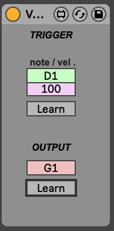

# Max for Live Devices

Welcome to the Max for Live Devices repository! This project hosts a collection of Max for Live devices designed to enhance your Ableton Live experience. Whether you're looking to add unique functionalities or experiment with new sounds, these devices offer a range of possibilities.

## Current Devices

### VelocityTriggeredNote

The first device in our collection is **VelocityTriggeredNote**. This device allows users to set a specific note and velocity trigger. When the trigger is met, it outputs a different note set by the user. This is particularly useful for creating dynamic variations in your music, such as triggering a Ride Bell sound when hitting the Ride with force.

#### Features:
- **Note Trigger**: Set the note that triggers the output.
- **Velocity Trigger**: Define the velocity threshold that must be met to trigger the output note.
- **Output Note**: Set the note that will be output when the trigger conditions are met.

#### Screenshot

## Future Devices

More devices will be added to this repository over time. Stay tuned for updates and new additions to enhance your creative workflow!

## Contributions

Contributions are welcome! If you have ideas for new devices or improvements to existing ones, please open an issue or submit a pull request.

## License

This project is licensed under [The Unlicense](LICENSE). See the [LICENSE](LICENSE) file for details.
